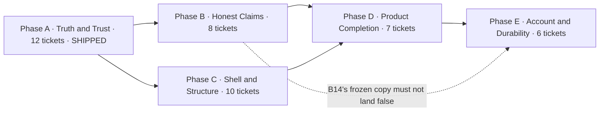

# comp3tive — the cross-phase contract

**Status:** accepted (reconstructed 2026-09-28)

Twenty documents cite this file as the authority for the phase order, per-phase file ownership, the
frozen interface names, and the cross-phase rules. It had never been committed: every citation
resolved to nothing. This file is that authority, rebuilt from the four 2026-09-17 specs and plans,
the Phase A ledger, and the backend spec — and it now covers Phase E.

**Who cites it.** Twenty files: the four 2026-09-17 specs (28 mentions), the four plans (18), eight
tickets under `.scratch/debt/issues/` (11), and the three task-briefs under
`.superpowers/sdd/2026-09-17-truth-and-trust/` (3). **What it was rebuilt from, and which does not
cite it:** `.scratch/backend/spec.md`, `docs/adr/0007-optional-backend.md`,
`docs/adr/0008-account-identity.md`.

**How to read an ownership row.** *Exclusive write* means the phase may edit that path freely and
no other phase may. *Named region* means one named function, string or element inside a file another
phase owns, and nothing else. *Reads, never writes* means the file may be imported and nothing more.
A path absent from every row is nobody's — treat that as a defect in this file and say so.

---

## 1. The order



**A before C, C before D, D before E.** B does not block C in principle, and the earlier drafts of
this contract and of the roadmap both said the two phases "touch disjoint files". **That was wrong,
and it is the exact mistake this document exists to prevent**: they share `src/App.tsx` and
`src/session/SplitScreen.tsx`, with four owners between them (`contracts.md` §5 and §6). Run B, then
C. The dashed edge is the only dependency that is about a *string*: B14 freezes
the landing trust row as `Your data stays on your device. No account, no server.`, and E03 exists to
take that promise back, so E03 must land with or after B14. Sequencing E after D satisfies it by
construction.

**A is done.** Branch `feature/debt-truth-and-trust`, commits `c05c58f..d057c89`, merged as `edfd739`
(PR #4). The browser suite went from 16 failed / 25 passed / 1 skipped to 43 passed / 0 failed /
0 skipped; unit tests from 114 to 154. Ledger: `.superpowers/sdd/2026-09-17-truth-and-trust/progress.md`.

**Nothing in B, C, D or E has started.** `src/session/gapProvenance.ts`, `src/shell/**`,
`src/ui/constants.ts`, `src/share/**` and `server/**` do not exist. `src/App.tsx` is 1,315 lines
against Phase C's under-400 target; `tsconfig.app.json:18` is still `noUnusedLocals: false`; the
three dead modules Phase C deletes are still on disk.

**If a frozen name below is missing, stop.** Every phase plan is written against these names. A
later phase that finds a name changed, or a file the contract says exists and does not, must stop
and report rather than adapt silently.

---

## 2. Constraints that bind every phase

Copied from the specs. Values are exact.

- **Zero new runtime dependencies.** `package.json` `dependencies` is `{"react": "^19.1.0",
  "react-dom": "^19.1.0"}` and stays that way. The share poster is hand-drawn to `<canvas>`; no
  DOM-to-image library. Reversing this needs an ADR.
- **Unit tests collect `.ts` only.** `vite.config.ts:22` sets `test.include: ["src/**/*.test.ts"]`,
  so `.tsx` is excluded from the unit harness. An extracted hook that must be unit-testable cannot
  be `.tsx`.
- **The unit environment is `node`.** `vite.config.ts:21` sets `test.environment: "node"`. No
  `jsdom`, no `happy-dom`, no `@testing-library`. Unit tests cover pure functions and hook shape via
  `renderToStaticMarkup`; anything needing a real layout is proven by a Playwright spec.
- **`workers: 1` and `retries: 0`.** `e2e/playwright.config.ts:6-7`. Retries hide the class of debt
  this programme exists to remove. `workers: 2` is measured and green (29.9 s against ~60 s; nothing
  shared blocks it) and is deliberately deferred to whoever owns CI tuning.
- **Playwright serves `dist/`.** `e2e/playwright.config.ts:17-22` runs `npm run preview` with
  `reuseExistingServer: true`, so **rebuild before trusting any e2e run**: `npx vite build` first.
- **Playwright spawns `npm run preview` from the repo root, not from `e2e/`.**
  `e2e/playwright.config.ts:23` sets `webServer.cwd: ".."` because Playwright resolves the
  command against the config file's own directory and `e2e/` has no `package.json` — without
  it the command fails ENOENT and **the suite cannot start at all**. The `reuseExistingServer`
  in the block above hid the defect: every recorded local run already had a preview server
  up, so the broken command was never exercised. CI runs it cold, on a fresh runner.
- **Playwright paths are relative to `e2e/`.** `testDir` is `./tests`, so a single-spec run is
  `npx playwright test --config=e2e/playwright.config.ts tests/<group>/<file>.spec.ts`. A bare
  `e2e/tests/...` path finds no tests.
- **"No spec edited" binds `e2e/tests/**` only.** It is Phase C's behaviour net, not a global rule.
  Unit tests may change where a real API change requires it. It does **not** apply to
  `docs/FLOW.md` — B owns that and C28 must leave it byte-identical.
- **A green suite gates every phase.** No phase ends with a failing test.
- **The solver is not touched by B, C, D or E.** No ticket changes `NODE_BUDGET`
  (`src/solver/solver.ts:21`), the pruning bound, the search order, or any file under `src/solver/`.
- **The catalog is returned in `SEED_DISCIPLINES` order, custom disciplines last.**
  `orderDisciplines` (`src/domain/seed.ts:89`) is applied by both stores —
  `src/storage/memory.ts:68` and `src/storage/indexed-db.ts:358` — because a store reads its
  rows in ascending key order, which is alphabetical, so badminton would lead. The seed's own
  order is load-bearing, not cosmetic: `disciplines[0]` is the new-tournament default
  (`src/tournament/GamesScreen.tsx:51`) and the seed of `startMatch`'s tie-break
  (`src/App.tsx:247`, whose strict `>` keeps the earlier discipline when two are equally
  playable). Reordering `SEED_DISCIPLINES` changes what the app defaults to, so the array and
  every sentence that names the catalog in order are edited together.
- **Adding a discipline means a `DB_VERSION` bump and a `SEEDS_ADDED_IN` entry.**
  Phase B raised `DB_VERSION` 6 → 7 (`src/storage/indexed-db.ts:19`) and added
  `7: [BADMINTON_DISCIPLINE]` (`:28-30`) with the upgrade branch that writes exactly those
  seeds (`:71-80`). **No ticket asked for it**, and without it every existing install would
  have run forever on two disciplines with no path to gain badminton: the whole catalog is
  only written on a first open (`:66-70`). An upgrade deliberately writes only the seeds its
  version introduced, never the whole catalog — the catalog is the user's to edit, and
  re-seeding it would resurrect a discipline they deleted.
- **Authority is the server's; the read path is IndexedDB.** From Phase E, a signed-in Organizer's
  Account is the source of truth, and this device holds a write-through cache of it. Two rules follow
  for every phase, including the ones that run before E: **no screen may await a `fetch` to render**
  (a signed-in Organizer on a court with no signal reads the cache), and **no write may be described
  as saved until the server has accepted it**. A Guest is unaffected — local only, no account, no
  network — and a phase must not require an Organizer to sign in to use a feature. ADR-0007.
- **A stale write is asked about, never merged and never dropped.** A Community's collections are
  replaced wholesale against a version, so a device that is behind is refused rather than allowed to
  overwrite. The refusal is surfaced to the Organizer, naming the Community, because the person who
  would lose the data is the one offline at the time.
- **Owner-authored files need explicit confirmation, recorded in the ticket's `## Comments`.**
  `DOMAIN_MODEL.md`, `IMPLEMENTATION_PLAN.md`, `COMP3TIVE_COMPREHENSIVE_ANALYSIS.md` and
  `docs/design.md` were authored by the repo owner. Nothing is moved or deleted without it.

---

## 3. File ownership

### Phase A — Truth and Trust (shipped)

| Path | Right |
|---|---|
| `e2e/**` (created `e2e/support/seed.ts`, `e2e/tsconfig.json`) | exclusive write |
| `src/ErrorBoundary.tsx`, `src/data/transfer.ts`, `src/data/player-import.ts`, `src/session/edit.ts` | exclusive write |
| `.github/workflows/ci.yml`, `package.json` (`e2e` script) | exclusive write |
| `.gitignore`, `playwright-report/`, `test-results/` | exclusive write |
| `src/session/SplitScreen.tsx` | named region: the `reroll` handler only (`:262-285`) |
| `src/tournament/bracket.ts` | named regions: `selectPairing`, the last-resort branch, the `standings` sort |
| `src/App.tsx` | named regions: the three delete handlers, the import handlers |
| `sample-data/futsal-roster.json` | Phase B owns this; A made a minimal correction under Ruling R16 |

### Phase B — Honest Claims

The B spec keeps an exclusive-set list and asserts of it that "every file above is inside Phase B's
exclusive set" (`honest-claims-design.md:902`). **That claim is false for nine paths B writes** — they
appear in the spec's per-ticket Files table but not in that list. The real set, below:

| Path | Right |
|---|---|
| `index.html`, `src/landing.tsx` | exclusive write |
| `src/landing.css` | claimed but **written by no task** — a phantom grant; do not treat it as reserved |
| `src/session/SplitScreen.tsx` | gap copy only (B13) **plus** `:325` and `:421` (B15) |
| `src/App.tsx` | named regions `:1090` and `:1152` (B15) — claimed in the spec's Files table, absent from its exclusive-set list |
| `src/session/MatchScreen.tsx` | named region `:48` (B15) — claimed in the Files table, absent from the exclusive-set list |
| `src/domain/seed.ts`, `src/session/gapProvenance.ts` (+ its test) | exclusive write |
| `sample-data/*.json`, `sample-data/badminton-roster.json` | exclusive write |
| `docs/FLOW.md`, `docs/spec/0002-tournaments-v1.md`, `DESIGN.md`, `docs/design.md` (superseded 2026-09-28) | exclusive write |
| `docs/adr/0002-tournament-first-flow.md`, `docs/adr/0004-origin-aware-navigation.md` | exclusive write (B18) |
| `docs/spec/0001-team-builder-v1.md` | exclusive write, **B19 only** — see §7 D1 |
| `docs/superpowers/plans/2026-09-10-paper-pencil-redesign.md`, `docs/archive/` | B16 only — claimed in the Files table, absent from the exclusive-set list |
| `src/data/sample-data.ts` (badminton registry entry) | B19 only — claimed in the Files table, absent from the exclusive-set list |
| `docs/agents/domain.md` | **verified, never written.** The spec's Files table says "(verify only)" while its own body says "No edit" |
| `e2e/tests/landing/landing.spec.ts` | a named, deliberate exception: B14 touches the trust-list block, the lede assertion, and adds one test |
| `e2e/tests/split/gap-provenance.spec.ts`, `e2e/tests/community/noun.spec.ts` (new) | exclusive write |
| `src/domain/seed.test.ts`, `src/storage/indexed-db.test.ts`, `src/storage/migration.test.ts`, `src/domain/validation.test.ts`, `src/data/sample-data.test.ts`, `src/data/sample-data.validation.test.ts` | B19's six test edits — the ownership table lists production paths only, and B19 changes a production constant whose assertions live here |

### Phase C — Shell and Structure

**Create — the extraction surface.** `src/shell/useNavigation.ts`, `src/shell/nav-items.ts`,
`src/shell/useCommunityScope.ts`, `src/shell/useSplitFlow.ts`, `src/shell/RosterScreen.tsx`,
`src/shell/AppChrome.tsx`, `src/shell/usePlayerImport.ts`, `src/shell/useToasts.ts`,
`src/shell/usePreferences.ts`, `src/shell/navigation.test.ts`, `src/shell/community-scope.test.ts`,
`src/shell/split-flow.test.ts`, `src/ui/constants.ts`, `src/ui/format.ts`, `src/ui/format.test.ts`,
`src/ui/Modal.tsx`, `src/ui/ConfirmButton.tsx`, `src/ui/Toasts.tsx`, `src/data/sample-registry.ts`,
`src/split.css`, `README.md`, `.nvmrc`.

**Delete — the only three deletions, 415 lines.** `src/tournament/tournament-domain-fix.ts` (270
lines, zero importers, a second `validateTournamentSpec`), `src/session/split-module.ts` (48 lines,
zero importers), `src/tournament/team-participation-validator.ts` (97 lines, its only importer is an
unused import at `src/App.tsx:49`).

**Modify.** `src/App.tsx` (1,315 lines today → under 400; the C plan's baseline was 1,280 at `d87ac7b`); `src/landing.tsx` (drop `./index.css`);
`src/index.css` and `src/landing.css` (add `@import "./split.css";`, move 110 rules, delete the dead
`pulse-needle`); `src/nav.tsx`; `src/session/MatchScreen.tsx`, `src/session/SplitScreen.tsx`,
`src/tournament/TournamentScreen.tsx` (render the shared `Breadcrumb`); `src/DashboardScreen.tsx`,
`src/tournament/GamesScreen.tsx`, `src/domain/DisciplineEditModal.tsx`, `src/roster/PlayerEditModal.tsx`,
`src/session/HistoryScreen.tsx`, `src/session/SquadsScreen.tsx` (shared constants, shared `Modal`,
two-step confirm); `src/domain/useDisciplines.ts`; `src/data/sample-data.ts` (loader only);
`src/data/sample-data.test.ts`; `tsconfig.app.json` (`"noUnusedLocals": true`, nothing else);
`package.json` (`"engines": { "node": ">=22.20 <23 || >=24.12" }`; `npm` deliberately unpinned);
`vite.config.ts` — **conditional**, and no task exercises it. Ticket 29's file list omits it.
`README.md` freezes `.nvmrc` at `24.16.0`.

`src/tokens.css` is **not** C's. It appears in C's documents only as a pre-existing import
(`src/index.css:2`, `src/landing.css:7` already carry `@import "./tokens.css";`). See §7 D7.

### Phase D — Product Completion

| Path | Right |
|---|---|
| `src/share/**` (new: `share-text.ts`, `share-image.ts`, `fairness.ts`, `ShareSheet.tsx`) | exclusive write |
| `src/data/round-robin.ts`, `src/data/csv-template.ts` | exclusive write (new) |
| `public/manifest.webmanifest`, `public/sw.js`, `public/fonts/**`, `public/icons/**` | exclusive write (new) |
| `src/fonts.css`, `scripts/make-icons.mjs` | exclusive write (new) |
| `src/shell/useDurability.ts`, `src/roster/BulkRateModal.tsx` | exclusive write (new) |
| `src/tournament/tournament-validation.ts` | exclusive write |
| `src/tournament/bracket.ts` | round-robin arms only |
| `src/main.tsx` | service-worker registration only, on `window`'s `load` event, outside the error boundary |
| `src/shell/RosterScreen.tsx`, `src/shell/usePlayerImport.ts` | C's files, extended: `visiblePlayers`, `notify`, `lastReport` |
| `src/shell/useSplitFlow.ts` | C's file: `consumeTeams` gains the round-robin guard |
| `src/data/player-import.ts`, `src/session/gapProvenance.ts` | **reads, never writes** |
| `src/session/flow.ts` | **amended by D's Task 38 follow-up** — see below |
| `package.json` | plan-only Modify: no dependency added |
| `src/tournament/team-counts.test.ts`, `e2e/tests/dashboard/nudge.spec.ts`, `e2e/tests/split/fairness.spec.ts`, `e2e/tests/share/*.spec.ts` | new coverage |

### Phase E — Account and Durability

| Path | Right |
|---|---|
| `server/**` (new) | exclusive write |
| `src/data/transfer.ts` | exclusive write: `version: 5` with `disciplines[]` |
| `src/domain/types.ts` | exclusive write: `Player.createdAt`, the Account and Credential types |
| `wrangler.jsonc` | exclusive write: the Worker script plus `assets.run_worker_first: ["/api/*"]` |
| `index.html`, `public/404.html` | E03's copy only — and only with or after B14 |
| `e2e/tests/account/**` (new) | exclusive write |
| `src/storage/types.ts` | **the seam does not change shape.** Every `list*()` keeps taking no arguments; Community scoping stays a filter in the React layer. The server learns which Account is asking from the token, never from the payload. The six stores become a write-through cache, not the app's window onto the server |
| `src/App.tsx` (sign-in surface), `src/shell/**` | after C, the sign-in surface belongs in the shell, not in a 1,315-line component |
| `.github/workflows/ci.yml` | E's first deploy step; the repo has none today |

---

## 4. Frozen interfaces

### Created by A — shipped

```ts
// e2e/support/seed.ts
export interface SeedWorld { /* … */ }
export function seedScript(world: SeedWorld): string;
export function gotoSeeded(page: Page, world: SeedWorld): Promise<void>;
export function hubButton(page: Page, name: HubName): Locator;   // getByRole("button", { name, exact: true })
export function gotoHubSeeded(page: Page, world: SeedWorld, name: HubName): Promise<void>;

// src/data/transfer.ts
export function parseBackup(text: string, disciplines?: Discipline[]): BackupData;

// src/data/player-import.ts
export const MAX_IMPORT_BYTES: number;
export interface CsvRow { line: number; name: string; discipline: string; strength: number }
export interface ImportSkip { line: number; reason: string }
export function assertImportSize(file: File): void;
export function parsePlayerCsv(text: string): { rows: CsvRow[]; skipped: ImportSkip[] };
export function csvRowsToPlayers(rows: CsvRow[], disciplines: Discipline[], communityId: Id): { players: Player[]; skipped: ImportSkip[] };

// src/ErrorBoundary.tsx
export class ErrorBoundary extends React.Component<
  { children: ReactNode },
  { error: Error | null }
> { static getDerivedStateFromError(error: Error): { error: Error } /* … */ }
```

`hubButton` is exactly `page.getByRole("button", { name, exact: true })` with `name` typed as the
five-literal hub union (`Home`, `Roster`, `Games`, `History`, `Squads`). **The nav buttons carry no
`aria-label` and none is added** — their accessible name is their visible label. No spec may address
a hub by index or by a layout-specific selector.

`DB_VERSION` is exported from `src/storage/indexed-db.ts:19` and the seed helper imports it. The
harness and the app cannot drift on the schema version.

### Created by B

```ts
// src/session/gapProvenance.ts — free of React, DOM and solver imports
export type GapKind = "proven" | "best-found";
export function gapKind(result: SplitResult): GapKind;   // "proven" iff result.solver.optimal === true
export function gapQualifier(result: SplitResult): string | null;   // "Best gap found." or null

// src/domain/seed.ts
export const BADMINTON_DISCIPLINE: Discipline;
// roles front-court / rear-court; attributes technical, fitness, game-iq;
// strengthModel { kind: "mean" }; team { minTeamSize: 2, maxTeamSize: 2, rolesRequired: true }
```

`proven` **iff** `result.solver.optimal === true`. Read that field and nothing else — not the source,
not the re-roll counter, not `nodesExplored`. The budget is not predictable from pool size, so no
copy may encode a size rule. The qualifier is exactly the three words `Best gap found.`, riding
inside the existing `<span className="fine">`. No new CSS, no new classes, no layout change.
Banned tokens in that copy: `aborted`, `node budget`, `heuristic`, `search`, `exhaustive`, em-dashes.

### Created by C

```ts
// src/shell/useNavigation.ts
export type HubMode = "dashboard" | "roster" | "games" | "history" | "squads";
export type View =
  | { mode: "roster" } | { mode: "dashboard" } | { mode: "games" }
  | { mode: "history" } | { mode: "disciplines" } | { mode: "squads" }
  | { mode: "tournament"; id: Id } | { mode: "match"; source: SplitSource }
  | { mode: "split"; source: SplitSource };
export function useNavigation(initial: View): {
  view: View; viewStack: View[];
  pushView: (v: View) => void; goBack: () => void;
  gotoHub: (mode: HubMode) => void; resetTo: (v: View) => void;
};
export function pushStack(stack: View[], v: View): View[];
export function popStack(stack: View[]): View[];   // never returns an empty array
export function hubStack(mode: HubMode): View[];
export function currentView(stack: View[]): View;

// src/shell/useCommunityScope.ts
export function scopeCommunities(input: CommunityScopeInput): CommunityScopeResult;
export function useCommunityScope(input: CommunityScopeInput): CommunityScopeResult;
// input: { communities, activeCommunityId, players, sessions, tournaments, squads, disciplines? }
// result: { activeCommunity, players, sessions, tournaments, squads, disciplinesById }

// src/shell/useSplitFlow.ts
export type SplitSource = "ad-hoc" | "tournament" | "session" | "squad";
export function splitFlowRule(source: SplitSource): {
  persistsSession: boolean; submitsTournament: boolean; isSynthetic: boolean;
};
export function rerollPool(
  source: SplitSource, sessionPoolPlayerIds: Id[] | null, currentTeams: TeamAssignment[],
): Id[];

// src/ui/constants.ts
export const BIB: readonly ["a", "b", "c", "d", "e"];
export const FORMAT_LABEL: Record<TournamentFormat, string>;   // D16 adds "round-robin"; the type is the reminder
export const STATUS_LABEL: Record<TournamentStatus, string>;

// src/ui/Modal.tsx
export function Modal({ onClose, children }: { onClose: () => void; children: ReactNode });

// src/shell/useToasts.ts  — per-caller state, NOT a context
export function useToasts(): {
  toasts: Array<{ id: string; text: string; type: ToastType }>;
  notify: (text: string, type?: ToastType) => void;
};

// src/shell/usePlayerImport.ts
export function usePlayerImport(deps: PlayerImportDeps): {
  pendingMerge: { counts: Record<string, number>; apply: () => Promise<void> } | null;
  confirmMerge: () => void; cancelMerge: () => void;
  lastReport: { imported: number; skipped: ImportSkip[] } | null;
  importFile: (file: File) => Promise<void>;
};
export type ImportReport = { imported: number; skipped: ImportSkip[] };
```

`splitFlowRule`'s truth table is frozen: `{ true, false, false }` for `ad-hoc`, `{ false, true,
false }` for `tournament`, `{ false, false, true }` for both `session` and `squad`.

`useToasts` is called **once**, in `src/App.tsx`, and `notify` is threaded down as a prop. A
component that is not `App` must never call it: its own state would be a second list nothing
renders. `src/` contains no `createContext` and C does not add a `ToastProvider`.

`Modal` owns the wrapper and the two handlers only. Each call site keeps its own `modal-close`
button, title and content byte-for-byte, and `src/index.css` does not change.

`NAV_ITEMS` moves to `src/shell/nav-items.ts` **unchanged in value** — its accessible names are
what the whole e2e suite matches on.

### Created by D

```ts
// src/share/share-text.ts — pure, no DOM, no React, no solver import
export interface ShareTextInput {
  communityName: string; disciplineName: string;
  discipline: Discipline; result: SplitResult; roster: Player[];
}
export function teamsAsText(input: ShareTextInput): string;

// src/share/share-image.ts
export type DrawOp =
  | { kind: "rect"; x: number; y: number; w: number; h: number; fill: string }
  | { kind: "roundRect"; x: number; y: number; w: number; h: number; r: number; fill: string }
  | { kind: "text"; x: number; y: number; text: string; font: string; fill: string; align: "left" | "right" };
export interface LayoutShareImageInput {
  disciplineName: string; discipline: Discipline; result: SplitResult; roster: Player[];
}
export function layoutShareImage(input: LayoutShareImageInput): { width: number; height: number; ops: DrawOp[] };
export function renderShareImage(input: LayoutShareImageInput): Promise<Blob>;
//
// src/share/fairness.ts
export interface FairnessInput { result: SplitResult; discipline: Discipline; roster: Player[] }
export function explainFairness(input: FairnessInput): { averages: string; trade: string };

// src/data/round-robin.ts — no imports; pairs team INDICES
export interface RoundRobinPairing { round: number; teamA: number; teamB: number | null }
export function roundRobinSchedule(n: number): RoundRobinPairing[];

// src/shell/useDurability.ts
export function useDurability({ playerCount }: { playerCount: number }): {
  persisted: boolean | null; granted: boolean | null; lastExportAt: number | null;
  shouldNudge: boolean; dismissNudge: () => void; recordExport: () => void;
};
```

The poster reads literal token hexes and never `prefers-color-scheme` or `data-theme`, and awaits
`document.fonts.ready` before the first `fillText`.

**Amended by D's Tasks 1 and 3, 2026-09-28 — the spec's three-field freeze was its own error.**
Both `teamsAsText` and `layoutShareImage` take a **four**-field input and both need `discipline`,
because the slot ordering calls `strengthOf(player, discipline)`; the D spec froze a form at
`:186-190` that its own body cannot use. Three further rules are now load-bearing:

- **The poster is the light theme**, read from `src/tokens.css:9-40`. The dark block re-declares
  `--accent` as `#ea580c` at `:47`, so reading the wrong block ships the wrong brand colour silently.
- **The poster imports the same `closingLine` from `share-text.ts` rather than retyping it.** That
  string now has two consumers — a text box and a painted image — and the painted one is the harder
  to correct, because the text is no longer selectable. A hand-written third sentence fails both
  provenance cases under mutation, which the tests assert.
- **Both take `BIB` from `src/ui/constants.ts`** rather than re-declaring `["a","b","c","d","e"]`.
  The hexes are keyed by BIB's own keys, so a sixth bib fails to compile rather than rendering an
  uncoloured stripe. This phase has already removed four duplicate definitions of exactly this kind
  of constant; a fifth is not added.

**Amended by D's Task 38 follow-up, 2026-09-30 — `src/session/flow.ts` is now writable by D, to own
one name resolver.** It appeared in **no** phase's ownership table, and its neighbour
`gapProvenance.ts` is marked *reads, never writes*, so nothing had a claim on it.

The reason is that **eight copies of the same fallback** — `roster.find(p => p.id === id)?.name ?? "?"`
— live across `SplitScreen.tsx` (`:91`, `:397`), `SquadsScreen.tsx:40`, `benchAdvice.ts:291-292`,
`flow.ts:25`, `share-image.ts:295` and `share-text.ts:67`, and `contracts.md:410` says a fifth
duplicate of this kind is not added. **One of those eight renders a full stop straight after the
question mark** (`SplitScreen.tsx:397`, `...swap with ?.`), so the rule at `fairness.ts:90-93` — that
a full stop after the list prints `?.` — is a local patch on a global inconsistency, and the semicolon
chosen for the fairness line was right *within its clause* and wrong about the codebase.

`flow.ts` is the right home for one concrete reason rather than a tidy one: **all three surfaces
already import `strengthOf` and `teamName` from it** (`fairness.ts:2`, `share-text.ts:3`,
`share-image.ts:2`), and it **already holds a private `nameOf` at `:25` with the identical fallback**.
So this promotes an existing private helper rather than adding an edge, and the alternative —
putting it in `share-text.ts` — would invert the direction D established, where a measurement shares
no verdict with a surface. **The label and the terminator stay per surface**; only the name list is
shared, because only the fairness copy carries a mark.

**D37 does not import `gapProvenance.ts` at all.** Its copy must not restate or contradict a
provenance word: a unit test asserts neither returned string contains `proven`, `best gap`,
`best-found`, `exact`, `minimum`, `optimal`, `solver`, `search`, `node`, `heuristic` or `aborted`,
nor an em-dash.

### Created by E

Not yet frozen. `.scratch/backend/spec.md` fixes the *decisions*; the names are Phase E's plan to
freeze, and this row is where they get written down. Known requirements:

- `parseBackup` keeps its signature and gains a `version: 5` branch carrying `disciplines[]`, with
  v1–v4 migration. `serializeBackup` gains a matching parameter.
- `Player` gains `createdAt`. "Recently added" is physical order today — `list()` is a bare
  `getAll()`, `useRoster` applies no sort, and the Dashboard takes `players.slice(-3)`.
- The sync decision — adopt, push, reject-stale, clear — is **a pure function over two snapshots and
  a version**, and gets a direct unit test rather than being pinned only through the UI.
- The `Account` is its own opaque key. A passkey contributes a credential record; Google contributes
  an issuer-and-subject pair. A verified email is an attribute used to find the Account, never the
  key it is joined on. There is no path where presenting a Google token merges into an existing
  Account because an address matched.

---

## 5. The shared seams

One definition, one owner, many consumers. A consumer that duplicates one of these is a defect.

| Seam | Owner | Consumed by |
|---|---|---|
| `hubButton` / `seedScript` / `SeedWorld` | A01, A11 | every spec in the suite; B13, B14, B15 |
| `parseBackup`, `serializeBackup` | A05, E01 | `App.tsx`'s import/export; E's wire format |
| `CsvRow`, `ImportSkip`, `parsePlayerCsv`, `csvRowsToPlayers`, `MAX_IMPORT_BYTES`, `assertImportSize` | A08 | C27 (`usePlayerImport`), D36 (the template and the roster panel) |
| `ErrorBoundary` | A05 | `src/main.tsx`; D33 registers the service worker beside it, not inside it |
| `gapKind` / `gapQualifier` | B13 | D31 branches on `gapKind`; D37 must not restate what `gapQualifier` says |
| `View`, `HubMode`, `useNavigation` | C24 | C26, C27, and D writing against the frozen union |
| `useCommunityScope` | C25 | D34 and D36 read scoped lists rather than adding a fifth filter |
| `SplitSource`, `splitFlowRule`, `rerollPool` | C26 | D35 edits the `consumeTeams` guard where C26 puts it |
| `usePlayerImport`, `ImportReport` | C27 | D36 renders `lastReport`; D must not declare its own copy |
| `BIB`, `FORMAT_LABEL`, `STATUS_LABEL` | C23 | D35 adds the `"round-robin"` key, and the `Record` type fails the build until it does |
| `notify` | C26 | D's share sheet and bulk-rating modal take it as a prop |
| `DB_VERSION` | `src/storage/indexed-db.ts:19` | `e2e/support/seed.ts` imports it rather than copying it |
| The storage seam (`src/storage/types.ts`) | existing | E's sync caller is the only thing that talks to the network, and the only writer; the stores become its cache |

### Amended by Phase C, Task 6 — Phase D's plan must be re-derived before it runs

`src/shell/useSplitFlow.ts` now carries all three frozen exports plus a hook, and the hook's surface
grew by three members the Phase C plan did not specify, because `setup` moved into it:

- **`SplitFlowResult` gained `gotoHub` and `createTournament`.** `setup` used to call App's
  `gotoHub` — which cleared the setup — and the tournament branch called `openTournamentOverGames`
  plus `setSetup(null)`. Both had to travel with it.
- **`SplitFlowDeps` gained `view: View`,** because `split()` reads the live view to decide where a
  flow is going.
- **`SplitFlowDeps.tournaments` is the UNSCOPED list, not the community-scoped one.** The Phase C
  plan's Step 5 and Step 11 contradicted each other on this. Scoping it would mean a mid-flow
  community switch turned a valid bracket save into "the tournament is no longer in this community's
  list". The call site carries a comment saying so.

**Consequence: code written against the Phase C plan's stated interface will not compile.** Phase D's
plan is written against the pre-amendment shape. Writing Phase D's plan must be re-derived against
the landed file — the same discipline every Phase C task used, because the spec did not anticipate
`setup` moving into the hook.


**B's five renamed strings — carried, never re-derived.** `No players in this squad` →
`No players in this community`; `Split the squad` → `Split the roster`; `then the squad` →
`then the roster`; `Tournament squad` → `Tournament teams`; `Save tournament squad →` →
`Save teams to tournament →`. Two of the five live at `src/App.tsx:1090` and `src/App.tsx:1152` — the
two named regions C26 moves into `src/shell/RosterScreen.tsx`. **C must not rename independently — it
reads B15's outcome**, and moves whatever B wrote rather than re-typing it.

**Those two line numbers are historical and are kept deliberately.** They record where the strings
sat when Phase B renamed them, before Phase C's C26 moved them into `src/shell/RosterScreen.tsx`;
`src/App.tsx` no longer has 1,152 lines. That draws the rule this contract follows throughout:
**a citation describing a past state may name a line that has since moved; a citation asserting a
current fact may not.** Repointing a historical citation would erase the only record of what C was
told to move — and the mistake C11's fix round actually made was repointing *current* citations for
the same reason, so the two are now told apart explicitly.

### A recorded hazard for Phase D, found at Phase B's Task 1

**`gapKind` returned `"proven"` for a hand-edited team set. Phase C closed the cause on 2026-09-28.**
`swapPlayers` routes through `recomputeResult`, which used to stamp `optimal: true, nodesExplored: 0`
(`src/session/edit.ts:64`) — "no search ran", not "this arrangement is minimal" — so the mandated rule,
reading that field and nothing else, returned `"proven"` and suppressed the qualifier, leaving the
readout's own `Gap 0.3. <Team> leads.` / `Dead even. Fair game.` standing as an affirmative fairness
claim. The stamp now defaults to `optimal: false` (`src/session/edit.ts:72`), so a hand-edited result
is correctly `"best-found"` and the screen says **"Best gap found."** `gapKind` and `gapQualifier` are
unchanged and remain the single source of truth; D's share text imports them rather than re-deriving.

**What is still open, and is not fixed by that:** the *best-found* copy narrates a search that did not
run. For a hand-edited result `nodesExplored` is 0, so "the smallest gap found" and "the search
ended before proving it minimal" are both untrue — a different false claim than the one just removed.
Correcting it honestly needs a string that describes the *result* rather than the search, or a third
verdict. Recorded in `IMPLEMENTATION_PLAN.md`'s known-open table; it is a copy decision for D31's owner.


---

## 6. Files two phases touch, and the rule for each

| File | Phases | The rule |
|---|---|---|
| `src/session/SplitScreen.tsx` | A03 (`reroll`), B13 (gap copy), B15 (two strings), C26 + C28 (crumb block, pool expression), D31/D37/D38 (additive) | Each phase edits one named region. D's edit is purely additive: one `share?` prop, one `Share` button, one `<p className="fairness">`. Verify with `git diff -U0 src/session/SplitScreen.tsx \| grep -E "^-[^-]" \| grep -v "^---"` → no output. **One named exception, 2026-09-30:** the swap-prompt line at `:397` may lose its **trailing full stop**, and nothing else about that line. See §5. |
| `src/tournament/bracket.ts` | A07 (pairing, standings), D35 (round-robin arms) | D adds a `buildBracket` arm, a `roundsFor` arm, and extends `champion()` to also accept `"round-robin"`. The `series`, `single-elim` and `swiss` arms are not modified. |
| `src/main.tsx` | A05 (error boundary), D33 (SW registration) | Registration is added on `window`'s `load`, outside `<ErrorBoundary>`, with the rejection handled so a failed registration is silent. The render call and A05's wrapper are unchanged. |
| `src/App.tsx` | A (delete/import handlers), B15 (two strings), C (decomposition), E (sign-in) | Sequenced, never concurrent: A → B → C → E. |
| `vite.config.ts` | C29 (conditional, unexercised), D33 (one `plugins[]` entry) | D's edit is additive only. C claims this file conditionally and no task edits it — see §7 D8. |
| `sample-data/*.json` | A (minimal correction), B20 (rewrite wholesale) | A already landed; B replaces both files and adds badminton. |
| `docs/FLOW.md` | B16 (owns it), C28 (citation repointing) | C28's acceptance as written was `git diff --stat docs/FLOW.md` empty. **That record is false and is corrected here:** the controller twice instructed C28 to leave every line-number citation untouched, on the reasoning that stale citations are rot rather than a false claim of source of truth. C28 obeyed, and a review round then proved the file byte-identical. But C11 shrank `src/App.tsx` 600 → 472, which silently invalidated the citations into it. A line-number citation is a claim that a symbol lives at that line, so it is maintained, not left to rot. The rule is now: a phase that moves a symbol repoints the citations that name it, and the check is that every `path:line` in this file resolves to a real symbol at that line. |

`src/tokens.css` is **not** in this table. D's spec lists it against "C29 (the stylesheet split)",
but C29 never writes that file — `src/index.css:2` and `src/landing.css:7` already import it. The
row is stale. See §7 D7.

---

## 7. Recorded disagreements between the specs and the plans

Resolved here so no executor has to re-derive them. Where the plan is the later and richer document,
the plan wins and the spec's narrower form is noted.

- **D1 — `docs/spec/0001-team-builder-v1.md` is double-assigned.** The B spec's Files table gives

  it to B16 (`:890`) *and* B19 (`:894`); ticket 16's own text says "B19 owns this line".
  **B19 owns it; B16 does not edit it.**
- **D2 — "gap copy only" binds ticket 13, not the phase.** The phase-level claim conflicts with
  B15's two `SplitScreen.tsx` edits. The restriction is scoped to B13.
- **D3 — the badminton card is not conditional.** The B spec keeps a "remove the card" branch alive;
  its own self-review resolves it (B19 ships badminton, so the card stays and the rail fact becomes
  `3`). `3` is the only live value.
- **D4 — five strings are renamed, not six.** The B plan heads a five-row table "the six colliding
  strings". The spec, ticket 15 and the preserve-list are the authority.
- **D5 — B's ownership claim is false for nine paths.** See §3. The real set is recorded there.
- **D6 — `CsvRow` / `ImportSkip` / `parsePlayerCsv` are not B-consumed.** They are A08's, consumed
  by C27 and D36. B's only Phase-A symbol dependencies are `hubButton` and `seedScript`; its
  largest A dependency is behavioural (A03 must not write `result.solver`, A03 must restore re-roll,
  A05's strict `parseBackup` rejects the pre-B20 futsal sample until B20 lands).
- **D7 — `src/tokens.css` is not C's.** D's overlap row is stale and must not be carried forward.
- **D8 — `vite.config.ts` is claimed conditionally by C and unconditionally by D**, and reconciled
  in no overlap table. Record it as shared, with D's additive rule.
- **D9 — `useDurability` takes a `playerCount` argument and returns `recordExport`.** The D spec
  freezes five fields and no parameter; the plan freezes six plus the argument. The plan wins:
  `recordExport` is the only mechanism by which `tb-last-export` is ever written, and `playerCount`
  is the only owner of the "is there something to lose" gate.
- **D10 — `teamsAsText` and `layoutShareImage` take `discipline`.** The D spec's input types omit
  the field the plan's bodies require. The plan wins.
- **D11 — `champion()` does not return `null` for round robin; it returns the wrong team.** The D
  spec and ticket 35 say it falls through to a single-elim lookup and returns `null` silently. At
  `src/tournament/bracket.ts:396-399` it returns round 1's first recorded match's winner. The plan
  follows the source, and the regression test must be written so it cannot pass on the buggy code.
- **D12 — three files D creates are absent from the D spec's Files table:** `scripts/make-icons.mjs`,
  `src/tournament/team-counts.test.ts`, `e2e/tests/dashboard/nudge.spec.ts`. The plan is
  authoritative.
- **D13 — the C plan anchors `tsconfig.app.json:19`**; `noUnusedLocals` is on line 18 and line 19 is
  `noUnusedParameters`. Resolve the symbol, not the number.

**Line anchors generally.** Every `file:line` in the 2026-09-17 documents is anchored to
`HEAD d87ac7b`. Confirmed drift at `edfd739`: `.split-bar` is `SplitScreen.tsx:393`; `champion()` is
`bracket.ts:390`; `standings` is `bracket.ts:355`; `requiredMatches` is `bracket.ts:230`;
`buildBracket` is `bracket.ts:80`. **Each anchor names its symbol or quoted string beside the line,
and the symbol is authoritative. Resolve the symbol, not the number.**

---

## 8. What this file does not claim

- It does not restate a phase's design. That is the spec's job, and the plan argues from the spec.
- It does not freeze anything Phase E has not yet named. §4's E row is deliberately a shape, not a
  signature.
- It does not make the suite green. A red suite cannot gate a refactor, and no phase ends with one.
- It does not record the deferred residue. These are recorded, with reasoning, in
  `.superpowers/sdd/2026-09-17-truth-and-trust/progress.md`: the standings seed residue, the depth-3
  quoted-name class, the ReviewPanel coverage gap, the v1-handler coverage gap, and the
  `workers: 2` measurement.
