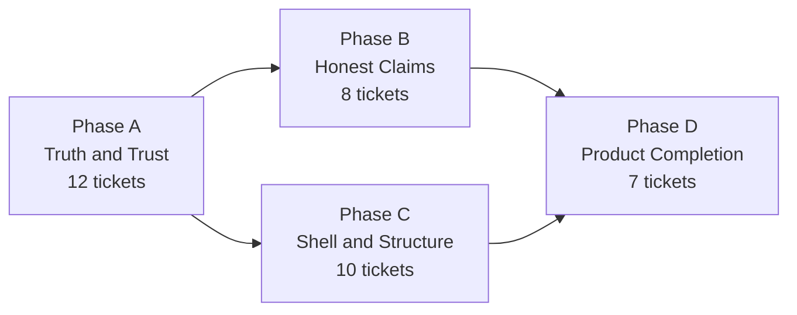

# comp3tive Debt Repayment Roadmap — 2026-09-17

**Status:** accepted (decisions locked 2026-09-17)

## Problem Statement

comp3tive's domain core is sound: a real exact-search fairness engine, a disciplined
glossary, six recorded architecture decisions, and 114 passing unit tests. Everything
around that core has drifted out of step with the product that actually shipped in the
days after those decisions were written.

Four kinds of debt, each with a different cost:

1. **The product lies about what it does.** The landing page promises an "exact, not
   estimated" gap. Measured here: that holds for a 2-team split and *fails for 4+*,
   which is what tournaments need. It sells "Re-rolls ∞" on a button that recomputes the
   identical teams while incrementing a counter. It promises "works with no signal" while
   shipping no service worker and loading its fonts from a CDN. It advertises badminton,
   which is not a discipline you can pick.

2. **Three everyday operations are visibly broken.** Re-roll (verified live: two clicks,
   identical output, badge advanced to `Roll #3`). Deletes (verified live: deleted a
   player, the row stayed on screen and reappeared gone only after reload). A malformed
   import can blank the app.

3. **Nothing verifies the work.** There is no CI. The browser suite — 42 tests that guard
   the flows above — is **currently red: 16 failed, 25 passed, 1 skipped.** Fourteen of
   those failures share one root cause: `681051d feat(shell): desktop rail layout` hid
   `.bottom-nav` behind a `min-width: 1024px` media query, and the suite runs at 1280×720
   and navigates through `.bottom-nav`. That commit touched no spec file.

4. **The structure resists the next feature.** `src/App.tsx` is 1,280 lines with 14
   `useState`, 0 `useMemo`, nine view modes inline, and four copies of the
   community-scoping rule. 318 lines of dead modules sit in the tree with a *second*
   definition of the tournament validation rules. No error boundary exists anywhere, so
   any render throw is a white screen.

And one gap that is not debt at all but is the largest commercial hole: **there is no way
to tell anyone the result.** The organizer computes fair teams and then retypes them into
the group chat by hand — the highest-friction step of the evening, at the moment of peak
satisfaction, in the only step that would bring new users in.

## Scope

Everything found in the 2026-09-17 audit: broken behaviour, dishonest claims, stale
documents, structural debt, and the missing capabilities that close the loop. 37 tickets
across four phases.

**Out of scope for this roadmap:**

- **Extending the solver's proof reach** (making 4-team/20-player provable). Explicitly
  deferred as its own bet per the fairness decision below; it is uncertain work and must
  not block honesty. Tracked as a stretch ticket in Phase B notes.
- **A backend of any kind.** ADR-0001 stands; this roadmap does not revisit it.
- **Multi-user, sync, or accounts.** Out of scope per `PRODUCT.md`.
- **Landing Page visual redesign.** The Ledger composition is settled and its specs pass;
  this roadmap only corrects what it *claims*.
- **ESLint and a formatter.** A first run against 9,300 lines is a large diff of its own;
  it needs a dedicated pass, not a ride-along.

## Locked Decisions

Four decisions were taken by the maintainer on 2026-09-17. Every phase plan argues from
these; none may reverse them.

| # | Decision | Consequence |
|---|---|---|
| **D1** | **Honest now, solver reach later as its own bet.** Surface provenance (proven vs. best-found) and stop promising optimality the engine cannot deliver. | Phase B1 changes copy and UI, never the engine. Solver reach is a *stretch* ticket, attempted only after this roadmap lands. |
| **D2** | **Community is the noun — fix the UI.** `CONTEXT.md` is authoritative and already bans "squad" for the group, reserving it for Saved Squad. | Phase B3 renames UI strings to "Community". Saved Squad keeps its name. |
| **D3** | **Add round robin for 3/5/6/7 teams.** | Phase D4 adds a fourth format. Casual nights with 3 or 5 teams can currently split but cannot run a tournament at all. |
| **D4** | **Ship a real PWA — make the offline promise true.** Manifest + service worker caching both documents and assets, plus self-hosted fonts. | Phase D2 makes the existing claim true rather than removing it. |

## Approach

Four phases, executed in order. Each is an independent sub-project that ships working,
testable software on its own, and each follows this repo's own conventions: a spec in
`docs/superpowers/specs/`, tickets in `.scratch/debt/issues/`, an implementation plan in
`docs/superpowers/plans/`.

**Why this order.**

- **A first, because nothing else is safe until the suite is green.** A red suite cannot
  gate a refactor. Every later phase ends by running this suite, and its "no spec edited"
  rule is only meaningful once the spec suite passes.
- **B before D, because D2's offline work depends on B2's decision** about what the
  landing page may claim. Honesty is cheap and lands fast; product work is expensive.
- **C before D, because D's features land in the shell.** Adding five features to a
  1,280-line component before decomposing it would deepen the debt this roadmap exists to
  clear. D2 (the service worker) and D4 (round robin) touch `App.tsx` and
  `TournamentScreen.tsx` respectively, so C must land first.
- **B does not block C.** They touch disjoint files; C may begin once A is green.

**The ratchet.** This roadmap assumes the audit's measurements. If a phase discovers
complexity the audit missed, the phase stops and says so rather than absorbing it
silently — hidden complexity upgrades the work, never downgrades it.

## Phase A — Truth and Trust

**Goal:** the product stops lying about what it does, and the proof that it works turns
green and stays green.

**Exit criteria:**
- The browser suite passes with the spec suite re-anchored to the shipped layout.
- Re-roll produces a different split. Deletes remove the row. A malformed import shows a
  message instead of a blank screen.
- CI runs typecheck, unit tests, build, and the browser suite on every push; a red run
  blocks the change.
- No build artifacts are tracked in git, and `npm run e2e` exists.

**Tickets (`.scratch/debt/issues/`):**

| # | Ticket | Absorbs |
|---|---|---|
| 01 | Re-anchor the e2e suite to the shipped layout (rail) | *new — the largest single item* |
| 02 | Resolve the remaining failing assertions | *new* |
| 03 | Re-roll produces a different fair split | app-correctness/01 |
| 04 | Deletes remove the row from the screen | app-correctness/02 |
| 05 | Validate players where data enters; add an error boundary | app-correctness/03 |
| 06 | Import merge keeps each record's community | app-correctness/04 |
| 07 | Swiss pairs without rematches and crowns by play | app-health/08 |
| 08 | Import survives a bad file (CSV quoting, size, unknown discipline) | app-health/11 |
| 09 | Prune the specs that assert nothing; untrack the reports | app-correctness/05 |
| 10 | CI runs the checks | app-health/04 |
| 11 | e2e specs start from a seeded world | app-health/15 |
| 12 | Ticket hygiene: close the tickets that are already shipped | *new* |

## Phase B — Honest Claims

**Goal:** every claim the product makes about itself is true — in the UI, on the landing
page, and in the documents that both humans and agents read.

**Exit criteria:**
- The split screen distinguishes a gap that was proven minimal from the best gap found
  before search ended, in plain language.
- No landing-page claim outruns the build: the offline claim is either true (after D2) or
  provisional and marked so; badminton is either shipped or removed from the page.
- One noun for the group everywhere: **Community**.
- `docs/FLOW.md`, `docs/spec/0002`, `docs/design.md`, `docs/adr/0002`, and `docs/agents/*`
  agree with the code.

**Tickets:**

| # | Ticket | Absorbs |
|---|---|---|
| 13 | The split says whether its gap is proven | app-health/09 |
| 14 | The landing page claims only what ships | *new* |
| 15 | One noun: Community, everywhere | *new — D2* |
| 16 | Reconcile the documents that contradict the code | app-correctness/06 |
| 17 | Resolve the two competing design directions | *new* |
| 18 | ADR-0002 is accepted, not proposed | *new* |
| 19 | Badminton: ship it as a real discipline | *new — feeds D4/D6* |
| 20 | Sample data that matches the audience | *new* |

**Stretch (not scheduled):** extend the solver so 4-team pools are provable too. Attempt
only after D lands. Measured baseline to beat: 20 players / 4 teams exhausts the
4,000,000-node budget in ~3.1s and returns `optimal: false`.

## Phase C — Shell and Structure

**Goal:** the code can absorb the next five features without the shell growing.

**Exit criteria:**
- `src/App.tsx` is under 400 lines and holds no navigation, scoping, or flow rules.
- `noUnusedLocals` is on and the tree is clean under it.
- The 318 lines of dead modules are gone, and exactly one definition of the tournament
  validation rules exists.
- No native `alert`/`confirm` remains in the app.
- The Landing Page loads neither the app's JS chunk nor its stylesheet.

**Tickets:**

| # | Ticket | Absorbs |
|---|---|---|
| 21 | Delete the code nothing calls | app-health/01 |
| 22 | Let the compiler catch dead code | app-health/02 |
| 23 | One definition per shared constant | app-health/03 |
| 24 | Navigation moves out of the shell | app-health/05 |
| 25 | Community scoping expressed once | app-health/06 |
| 26 | The split and tournament flow move out of the shell | app-health/07 |
| 27 | Failures and confirmations speak the app's language | app-health/10 |
| 28 | The shared breadcrumb and page header are actually used | app-health/14 |
| 29 | Each document loads only what it needs | *new* |
| 30 | Project hygiene: README, engine floor, node pin | *new* |

## Phase D — Product Completion

**Goal:** the organizer's evening closes. They can tell ten people the teams, and the app
opens on the court.

**Exit criteria:**
- A finished split can be shared to the group chat without retyping it.
- The app opens with no signal and can be installed to the home screen; the fonts are
  self-hosted.
- The browser is asked to protect the data, and the user is nudged to export.
- A 3-team and a 5-team night can run a tournament.
- Bulk roster entry is a visible, documented path.

**Tickets:**

| # | Ticket | Absorbs |
|---|---|---|
| 31 | Share the result: copy the teams as text | *new — highest commercial value* |
| 32 | Share the result: render the teams as an image | *new* |
| 33 | A real PWA: manifest, service worker, self-hosted fonts | app-health/13 |
| 34 | The data has a durability story | app-health/12 |
| 35 | Round robin for 3, 5, 6, and 7 teams | *new — D3* |
| 36 | Roster fast entry: a visible CSV path and bulk rating | *new* |
| 37 | Make the split defensible in words | *new* |

## Testing Strategy

The phases differ in how their work is proven, and each plan states its own approach.
Three rules apply throughout:

- **A green suite gates every phase.** No phase ends with a failing test. Phase A makes
  this true; B, C, and D keep it true.
- **C and B's refactors are guarded by the existing suite, not by new tests.** The browser
  suite is what pins this app's behaviour; each extraction lands with the suite green and
  no spec edited. Anything extracted as a pure function or hook gets a direct unit test.
- **New user-visible behaviour gets a test at the seam that carries it.** Share gets a
  clipboard assertion; round robin gets an exhaustive scheduling test (the defect class is
  a property of the algorithm, so the test enumerates team-count/round combinations);
  the service worker gets an offline-load assertion.

## Risks

| Risk | Impact | Mitigation |
|---|---|---|
| Phase A1 underestimates the spec re-anchor | The suite stays red; every later phase loses its gate | Deliverable is a shared navigation helper, not 14 hand-edits. Verify by running the full suite, not a subset. |
| Decomposing the shell (C) regresses a flow | Silent breakage in navigation, which the suite is currently too weak to catch | C runs only after A11 seeds the specs deterministically. C1 lands green, then C2, one at a time. |
| The service worker (D2) serves stale assets | Users stuck on an old build — a worse failure than no offline support | Cache versioning keyed to the build hash, plus an explicit update path; assert a fresh deploy is picked up. |
| Round robin (D4) breaks the existing bracket tests | Three formats' tests pin shared bracket behaviour | Add round robin as a new format branch; do not alter `single-elim` or `swiss` paths. All existing bracket tests stay green. |
| Honesty work (B) reads as scope reduction | Stakeholder reads "stop claiming optimality" as a downgrade | The engine is unchanged and the proven case stays a strong claim. Provide the measured table. |

## Files

| Action | Path |
|---|---|
| Create | `docs/superpowers/specs/2026-09-17-debt-repayment-roadmap-design.md` (this file) |
| Create | `docs/superpowers/specs/2026-09-17-truth-and-trust-design.md` |
| Create | `docs/superpowers/specs/2026-09-17-honest-claims-design.md` |
| Create | `docs/superpowers/specs/2026-09-17-shell-and-structure-design.md` |
| Create | `docs/superpowers/specs/2026-09-17-product-completion-design.md` |
| Create | `docs/superpowers/plans/2026-09-17-truth-and-trust.md` |
| Create | `docs/superpowers/plans/2026-09-17-honest-claims.md` |
| Create | `docs/superpowers/plans/2026-09-17-shell-and-structure.md` |
| Create | `docs/superpowers/plans/2026-09-17-product-completion.md` |
| Create | `.scratch/debt/issues/01-…` … `37-…` |

## Spec Self-Review

- **Placeholders:** none — every ticket names its deliverable, every phase has exit
  criteria, all four decisions are recorded with their consequences.
- **Internal consistency:** the phase order matches the dependency graph; C is not blocked
  by B and is not written as if it were; B1 (provenance) is consistent with the solver
  being untouched, and its stretch note records the measured baseline rather than a wish.
- **Scope check:** 37 tickets is far too much for one plan, which is why `writing-plans`
  decomposes it into four plans. Each phase ships independently and has its own exit
  criteria.
- **Ambiguity check:** "no spec edited" (C's refactor rule) is scoped to *behaviour*
  specs — Phase A may rewrite specs because re-anchoring is its whole deliverable. This is
  stated in A's exit criteria and in the risks table.
